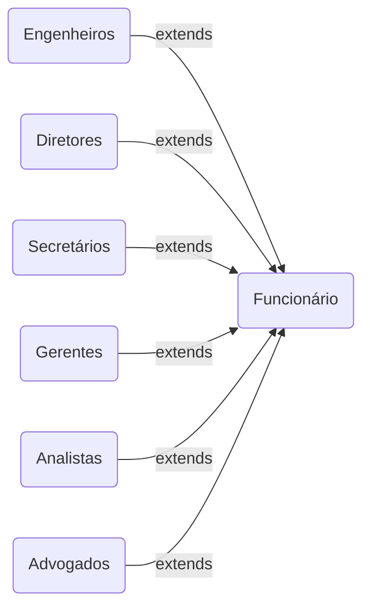

# POO - Classes Funcionário, Engenheiros, Diretores, Secretários, Gerentes, Analistas e Advogados

Projeto acadêmico em **Java** da matéria de Programação Orientada a Objetos. Programa desenvolvido com o objetivo de aprender os conceitos de **POO** utilizando as classes Funcionário, Engenheiros, Diretores, Secretários, Gerentes, Analistas e Advogados, criando atributos, métodos e construtores para cada classe. As classes Engenheiros, Diretores, Secretários, Gerentes, Analistas e Advogados herdam da classe Funcionário.

